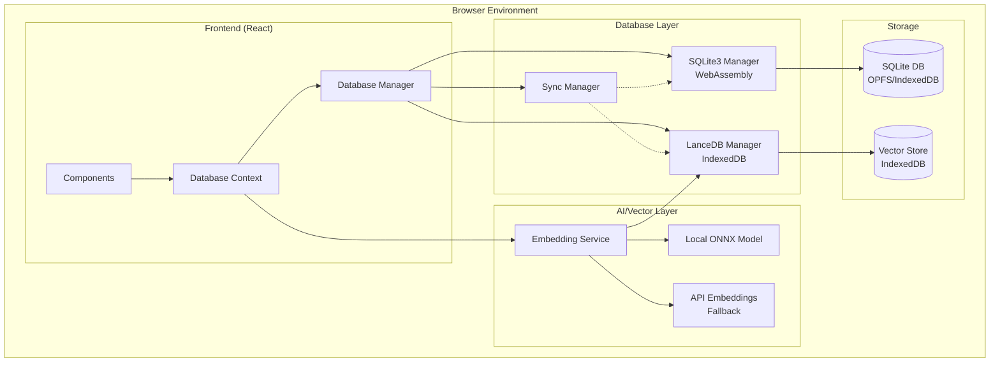

# Muse-Flow-AI Database Integration Plan

## Overview

This document outlines the comprehensive integration of SQLite3 and LanceDB into the Muse-Flow-AI application, creating a powerful dual-database system that combines relational data management with advanced vector operations for AI-powered writing features.

## Architecture Summary

### Key Components
- **SQLite3 via WebAssembly**: Primary relational database for core application data
- **LanceDB**: Specialized vector database for embeddings and similarity operations
- **Local Embedding Models**: Privacy-focused ONNX.js models running in browser
- **Hybrid Embedding System**: Multiple embedding sources with intelligent fallback
- **Unified Database Manager**: Coordinated access and synchronization between systems

### Design Principles
- **Privacy First**: All databases and AI processing remain local to user's device
- **Performance Optimized**: Connection pooling, caching, and efficient indexing
- **Backwards Compatible**: Seamless migration from existing localStorage system
- **Scalable Architecture**: Modular design supporting future enhancements

## System Architecture



## Database Schema Design

### SQLite3 Schema

```sql
-- Core project management
CREATE TABLE projects (
    id TEXT PRIMARY KEY,
    title TEXT NOT NULL,
    description TEXT,
    genre TEXT,
    target_word_count INTEGER DEFAULT 80000,
    current_word_count INTEGER DEFAULT 0,
    created_at DATETIME DEFAULT CURRENT_TIMESTAMP,
    updated_at DATETIME DEFAULT CURRENT_TIMESTAMP,
    metadata TEXT -- JSON blob for extensibility
);

-- Character management
CREATE TABLE characters (
    id TEXT PRIMARY KEY,
    project_id TEXT NOT NULL,
    name TEXT NOT NULL,
    role TEXT CHECK(role IN ('protagonist', 'antagonist', 'supporting', 'minor')),
    age INTEGER,
    description TEXT,
    backstory TEXT,
    traits TEXT, -- JSON array
    notes TEXT,
    created_at DATETIME DEFAULT CURRENT_TIMESTAMP,
    updated_at DATETIME DEFAULT CURRENT_TIMESTAMP,
    FOREIGN KEY (project_id) REFERENCES projects(id) ON DELETE CASCADE
);

-- Character relationships
CREATE TABLE character_relationships (
    id TEXT PRIMARY KEY,
    character_id TEXT NOT NULL,
    related_character_id TEXT NOT NULL,
    relationship_type TEXT NOT NULL,
    description TEXT,
    created_at DATETIME DEFAULT CURRENT_TIMESTAMP,
    FOREIGN KEY (character_id) REFERENCES characters(id) ON DELETE CASCADE,
    FOREIGN KEY (related_character_id) REFERENCES characters(id) ON DELETE CASCADE
);

-- Story structure
CREATE TABLE story_arcs (
    id TEXT PRIMARY KEY,
    project_id TEXT NOT NULL,
    title TEXT NOT NULL,
    type TEXT CHECK(type IN ('main', 'subplot', 'character')),
    description TEXT,
    status TEXT CHECK(status IN ('planning', 'active', 'completed')),
    notes TEXT,
    created_at DATETIME DEFAULT CURRENT_TIMESTAMP,
    updated_at DATETIME DEFAULT CURRENT_TIMESTAMP,
    FOREIGN KEY (project_id) REFERENCES projects(id) ON DELETE CASCADE
);

-- Story acts
CREATE TABLE story_acts (
    id TEXT PRIMARY KEY,
    story_arc_id TEXT NOT NULL,
    title TEXT NOT NULL,
    description TEXT,
    order_index INTEGER NOT NULL,
    created_at DATETIME DEFAULT CURRENT_TIMESTAMP,
    FOREIGN KEY (story_arc_id) REFERENCES story_arcs(id) ON DELETE CASCADE
);

-- Scenes
CREATE TABLE scenes (
    id TEXT PRIMARY KEY,
    story_act_id TEXT NOT NULL,
    title TEXT NOT NULL,
    description TEXT,
    location TEXT,
    notes TEXT,
    order_index INTEGER NOT NULL,
    created_at DATETIME DEFAULT CURRENT_TIMESTAMP,
    FOREIGN KEY (story_act_id) REFERENCES story_acts(id) ON DELETE CASCADE
);

-- Content blocks for granular text management
CREATE TABLE content_blocks (
    id TEXT PRIMARY KEY,
    project_id TEXT NOT NULL,
    content_type TEXT NOT NULL, -- 'main_text', 'character_desc', 'scene_desc', etc.
    content_id TEXT, -- Reference to character_id, scene_id, etc.
    content_text TEXT NOT NULL,
    word_count INTEGER DEFAULT 0,
    created_at DATETIME DEFAULT CURRENT_TIMESTAMP,
    updated_at DATETIME DEFAULT CURRENT_TIMESTAMP,
    FOREIGN KEY (project_id) REFERENCES projects(id) ON DELETE CASCADE
);

-- Indexes for performance
CREATE INDEX idx_characters_project_id ON characters(project_id);
CREATE INDEX idx_story_arcs_project_id ON story_arcs(project_id);
CREATE INDEX idx_content_blocks_project_id ON content_blocks(project_id);
CREATE INDEX idx_content_blocks_type ON content_blocks(content_type);
CREATE INDEX idx_scenes_act_id ON scenes(story_act_id);
```

### LanceDB Schema

```typescript
interface VectorEmbedding {
    id: string;
    project_id: string;
    content_type: 'story_content' | 'character_description' | 'scene_description' | 'plot_element';
    content_id: string; // Reference to source content
    content_text: string; // Original text
    embedding_vector: number[]; // 384-dimensional vector
    metadata: {
        word_count: number;
        section_type?: string;
        character_names?: string[];
        themes?: string[];
        timestamp: string;
    };
    created_at: string;
}
```

## Implementation Phases

### Phase 1: Core Database Infrastructure (Week 1-2)

#### 1.1 SQLite3 Integration
**Files to Create:**
- `src/database/managers/SQLiteManager.ts`
- `src/database/schemas/sqlite-schema.sql`
- `src/database/schemas/migrations/`

**Key Features:**
- WebAssembly SQLite via `sql.js`
- Origin Private File System API with IndexedDB fallback
- Connection pooling and transaction management
- Automatic schema migrations
- Query optimization with prepared statements

**Dependencies to Add:**
```json
{
  "sql.js": "^1.8.0",
  "@types/sql.js": "^1.4.4"
}
```

#### 1.2 LanceDB Integration
**Files to Create:**
- `src/database/managers/LanceDBManager.ts`
- `src/database/services/VectorService.ts`

**Key Features:**
- Browser-compatible LanceDB implementation
- IndexedDB backend storage
- Vector similarity search with metadata filtering
- Batch operations for efficiency
- Incremental indexing

**Dependencies to Add:**
```json
{
  "@lancedb/lancedb": "^0.4.0",
  "apache-arrow": "^14.0.0"
}
```

#### 1.3 Database Manager
**Files to Create:**
- `src/database/managers/DatabaseManager.ts`
- `src/database/managers/SyncManager.ts`
- `src/contexts/DatabaseContext.tsx`

**Key Features:**
- Unified interface for both databases
- Cross-database transactions
- Data synchronization between SQLite and LanceDB
- Error handling and recovery
- Connection lifecycle management

### Phase 2: Embedding System (Week 2-3)

#### 2.1 Local Embedding Models
**Files to Create:**
- `src/ai/embeddings/providers/ONNXEmbeddingProvider.ts`
- `src/ai/embeddings/models/` (model files)
- `src/ai/embeddings/EmbeddingManager.ts`

**Key Features:**
- ONNX.js integration for local model execution
- Model loading and caching strategies
- Progressive loading with user feedback
- Memory-efficient processing

**Models to Include:**
- Primary: `all-MiniLM-L6-v2` (22MB, 384 dimensions)
- Fallback: Browser-compatible alternatives
- Multilingual support options

**Dependencies to Add:**
```json
{
  "onnxruntime-web": "^1.16.0",
  "@huggingface/transformers": "^2.6.0"
}
```

#### 2.2 Hybrid Embedding Service
**Files to Create:**
- `src/ai/embeddings/providers/APIEmbeddingProvider.ts`
- `src/ai/embeddings/providers/EmbeddingProviderFactory.ts`

**Key Features:**
- Multiple embedding provider support
- Intelligent fallback mechanisms
- Provider availability detection
- Consistent interface across providers

#### 2.3 Text Processing Pipeline
**Files to Create:**
- `src/ai/text/TextProcessor.ts`
- `src/ai/text/ChunkingService.ts`

**Key Features:**
- Smart text segmentation
- Content preprocessing and normalization
- Batch processing capabilities
- Content hashing for cache efficiency

### Phase 3: AI-Powered Features (Week 3-4)

#### 3.1 Semantic Search System
**Files to Create:**
- `src/ai/features/SemanticSearch.ts`
- `src/ai/features/SearchResultsProcessor.ts`

**Key Features:**
- Multi-content-type search
- Similarity threshold configuration
- Metadata filtering
- Result ranking and relevance scoring

**Search Capabilities:**
- Find similar characters across projects
- Locate related plot elements
- Identify thematic connections
- Detect potential inconsistencies

#### 3.2 Content Recommendation Engine
**Files to Create:**
- `src/ai/features/ContentRecommendation.ts`
- `src/ai/features/RelationshipAnalyzer.ts`

**Key Features:**
- Character relationship suggestions
- Plot development recommendations
- Style consistency analysis
- Conflict detection and resolution

#### 3.3 Advanced AI Features
**Files to Create:**
- `src/ai/features/StyleAnalysis.ts`
- `src/ai/features/ThemeExtraction.ts`
- `src/ai/features/ConsistencyChecker.ts`

**Key Features:**
- Writing style embeddings
- Theme clustering and analysis
- Timeline consistency checking
- Character arc progression tracking

### Phase 4: Integration & Performance (Week 4-5)

#### 4.1 Performance Optimization
**Optimization Strategies:**
- Lazy loading of embeddings
- Multi-level caching (memory, IndexedDB, OPFS)
- Web Worker integration for heavy computations
- Streaming processing for large texts
- Connection pooling and reuse

#### 4.2 Memory Management
**Memory Optimization:**
- LRU cache for embedding vectors
- Proper WebAssembly memory cleanup
- Garbage collection optimization
- Resource monitoring and alerts

#### 4.3 Error Handling & Recovery
**Robustness Features:**
- Automatic retry mechanisms
- Graceful degradation on failures
- Data integrity validation
- Backup and restore capabilities

### Phase 5: Migration & Compatibility (Week 5-6)

#### 5.1 Data Migration
**Files to Create:**
- `src/database/migration/LocalStorageMigrator.ts`
- `src/database/migration/DataValidator.ts`

**Migration Features:**
- Automatic localStorage to SQLite conversion
- Embedding generation for existing content
- Data integrity validation
- Rollback support for failed migrations

#### 5.2 Backward Compatibility
**Compatibility Features:**
- Progressive enhancement approach
- Feature detection and graceful degradation
- Fallback to localStorage when needed
- Browser compatibility layers

## File Structure

```
src/
├── database/
│   ├── managers/
│   │   ├── DatabaseManager.ts          # Unified database interface
│   │   ├── SQLiteManager.ts            # SQLite operations
│   │   ├── LanceDBManager.ts           # Vector database operations
│   │   └── SyncManager.ts              # Cross-database synchronization
│   ├── schemas/
│   │   ├── sqlite-schema.sql           # SQLite table definitions
│   │   ├── migrations/                 # Database migration scripts
│   │   │   ├── 001_initial_schema.sql
│   │   │   ├── 002_add_content_blocks.sql
│   │   │   └── migration-runner.ts
│   │   └── seed-data.ts                # Development seed data
│   ├── services/
│   │   ├── QueryBuilder.ts             # SQL query builder
│   │   ├── TransactionManager.ts       # Transaction handling
│   │   └── IndexOptimizer.ts           # Index management
│   ├── migration/
│   │   ├── LocalStorageMigrator.ts     # Migrate from localStorage
│   │   ├── DataValidator.ts            # Validate migrated data
│   │   └── BackupService.ts            # Backup/restore functionality
│   └── types/
│       ├── database-types.ts           # Database type definitions
│       └── migration-types.ts          # Migration type definitions
├── ai/
│   ├── embeddings/
│   │   ├── providers/
│   │   │   ├── ONNXEmbeddingProvider.ts    # Local ONNX models
│   │   │   ├── APIEmbeddingProvider.ts     # External API providers
│   │   │   ├── EmbeddingProviderFactory.ts # Provider management
│   │   │   └── EmbeddingProvider.interface.ts
│   │   ├── models/                         # ONNX model files
│   │   │   ├── all-MiniLM-L6-v2/
│   │   │   └── model-loader.ts
│   │   └── EmbeddingManager.ts             # Embedding orchestration
│   ├── text/
│   │   ├── TextProcessor.ts                # Text preprocessing
│   │   ├── ChunkingService.ts              # Text segmentation
│   │   └── ContentHasher.ts                # Content hashing for cache
│   ├── features/
│   │   ├── SemanticSearch.ts               # Semantic search implementation
│   │   ├── ContentRecommendation.ts        # Content recommendations
│   │   ├── StyleAnalysis.ts                # Writing style analysis
│   │   ├── ThemeExtraction.ts              # Theme identification
│   │   ├── ConsistencyChecker.ts           # Content consistency analysis
│   │   └── RelationshipAnalyzer.ts         # Character relationship analysis
│   └── types/
│       ├── embedding-types.ts              # Embedding type definitions
│       └── ai-feature-types.ts             # AI feature interfaces
├── contexts/
│   ├── DatabaseContext.tsx                 # Database React context
│   └── AIContext.tsx                       # Enhanced with vector features
├── hooks/
│   ├── useDatabase.ts                      # Database operations hook
│   ├── useSemanticSearch.ts                # Semantic search hook
│   ├── useContentRecommendations.ts        # Recommendations hook
│   └── useEmbeddings.ts                    # Embedding operations hook
└── services/
    ├── database/
    │   ├── DatabaseService.ts              # High-level database service
    │   └── CacheManager.ts                 # Multi-level caching
    └── ai/
        ├── AIOrchestrator.ts               # AI feature coordination
        └── PerformanceMonitor.ts           # AI performance monitoring
```

## Performance Considerations

### Database Optimization
- **Indexing Strategy**: Comprehensive indexes on frequently queried columns
- **Connection Pooling**: Efficient connection reuse and lifecycle management
- **Query Optimization**: Prepared statements and query plan analysis
- **Batch Operations**: Bulk inserts and updates for improved performance

### Vector Operations
- **Embedding Cache**: LRU cache for frequently accessed vectors
- **Similarity Thresholds**: Configurable thresholds for performance tuning
- **Batch Embeddings**: Process multiple texts simultaneously
- **Incremental Updates**: Only re-embed changed content

### Memory Management
- **WebAssembly Memory**: Proper allocation and cleanup
- **Streaming Processing**: Handle large texts without memory overflow
- **Garbage Collection**: Optimize for browser GC patterns
- **Resource Monitoring**: Track memory usage and performance metrics

## Security & Privacy

### Privacy Protection
- **Local Processing**: All AI operations remain on user's device
- **No Data Transmission**: Databases never leave user's browser
- **Secure Storage**: Integration with existing SecureStorage service
- **Encryption Options**: Optional project-level encryption

### Data Security
- **Access Control**: Project-level permissions and isolation
- **Backup Security**: Encrypted export/import functionality
- **Memory Safety**: Secure WebAssembly execution environment
- **Input Validation**: Comprehensive data sanitization

## Testing Strategy

### Unit Testing
- Database manager functionality
- Embedding provider implementations
- AI feature accuracy
- Migration procedures

### Integration Testing
- Cross-database synchronization
- End-to-end workflows
- Performance benchmarks
- Error recovery scenarios

### Performance Testing
- Large dataset handling
- Memory usage profiling
- Concurrent operation stress tests
- Browser compatibility testing

## Deployment & Configuration

### Dependencies
```json
{
  "sql.js": "^1.8.0",
  "@lancedb/lancedb": "^0.4.0",
  "apache-arrow": "^14.0.0",
  "onnxruntime-web": "^1.16.0",
  "@huggingface/transformers": "^2.6.0",
  "@types/sql.js": "^1.4.4"
}
```

### Build Configuration
- WebAssembly file handling
- ONNX model bundling
- Service Worker registration
- Progressive Web App enhancements

### Environment Variables
```env
# AI Configuration
REACT_APP_ENABLE_LOCAL_AI=true
REACT_APP_DEFAULT_EMBEDDING_MODEL=all-MiniLM-L6-v2
REACT_APP_EMBEDDING_CACHE_SIZE=1000
REACT_APP_SIMILARITY_THRESHOLD=0.7

# Database Configuration
REACT_APP_ENABLE_VECTOR_DB=true
REACT_APP_DB_CACHE_SIZE=50MB
REACT_APP_AUTO_BACKUP_INTERVAL=300000
```

## Success Metrics

### Performance Metrics
- Database query response time < 100ms
- Embedding generation time < 2s per 1000 words
- Memory usage < 500MB for typical projects
- Search results relevance score > 80%

### User Experience Metrics
- Migration completion rate > 95%
- Feature adoption rate > 60%
- User satisfaction with AI recommendations > 4.0/5.0
- System reliability uptime > 99.5%

## Future Enhancements

### Advanced AI Features
- Multi-language embedding support
- Custom embedding model training
- Advanced style transfer capabilities
- Collaborative writing AI assistance

### Performance Improvements
- GPU acceleration for embeddings
- Advanced caching strategies
- Distributed processing capabilities
- Real-time collaboration support

### Integration Possibilities
- External writing tool integrations
- Cloud backup and sync options
- Publishing platform connections
- Advanced analytics and insights

## Conclusion

This comprehensive database integration plan transforms Muse-Flow-AI into a sophisticated, AI-powered writing platform while maintaining user privacy and ensuring high performance. The dual-database architecture provides both robust data management and advanced AI capabilities, creating a unique and powerful tool for fiction writers.

The implementation follows a phased approach that allows for iterative development, testing, and refinement, ensuring a stable and reliable system that enhances the writing experience without compromising on privacy or performance.